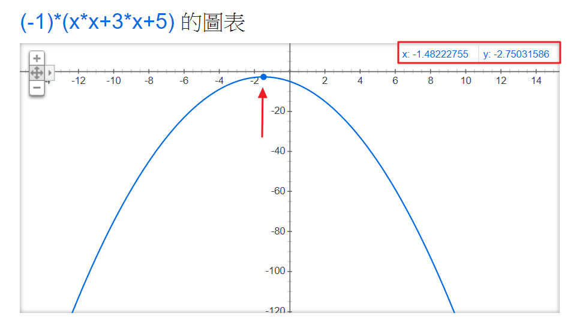
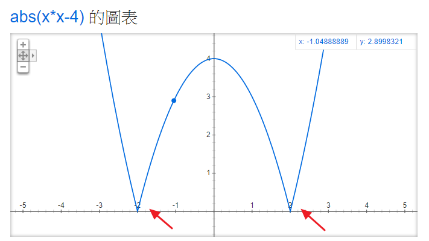

# :eyes: Outline
1. [hillClimbing1.py](hillClimbing1.py)
2. [hillClimbing2.py](hillClimbing2.py)
3. [hillClimbing2r.py](hillClimbing2r.py)
4. [hillClimbingNumber.py](hillClimbingNumber.py)
5. [hillClimbingArray.py](hillClimbingArray.py)
6. [solutionArray.py](solutionArray.py)
7. [hillClimbingEquation.py](hillClimbingEquation.py)
8. [solutionEquation.py](solutionEquation.py)
9. [hillClimbingScheduling.py](solutionScheduling.py)

# 1. hillClimbing1.py
## 1.1- Terminal
```
D:\ai108b\02-optimize> py .\hillClimbing1.py
```

## 1.2- Output
```
x=0.000 f(x)=-5.000
x=-0.010 f(x)=-4.970
x=-0.020 f(x)=-4.940
x=-0.030 f(x)=-4.911
x=-0.040 f(x)=-4.882
x=-0.050 f(x)=-4.853
...
x=-1.450 f(x)=-2.752
x=-1.460 f(x)=-2.752
x=-1.470 f(x)=-2.751
x=-1.480 f(x)=-2.750
x=-1.490 f(x)=-2.750
x=-1.500 f(x)=-2.750
```

## 1.3- Solution
* ``-1 * (x * x + 3 * x + 5)``
<br>

||
|:--:|
| Google 驗證　|

<br>

* 判斷式
  * `f(x + dx) > f(x)` : 如果　右邊的高度 f(x+dx) > 目前高度 f(x) ，那麼就 **往右走**
  * `f(x - dx) > f(x)` : 如果　左邊的高度 f(x-dx) > 目前高度 f(x) ，那麼就 **往左走**
  * other : 如果兩邊都沒有比現在的 f(x) 高，那麼這裡就是**區域最高點**，直接中斷傳回

* `hillClimbing(f, 0)`： 以 **x=0 為起點**，開始呼叫爬山演算法


## 1.4- Explain
* 找 **最低點**
* 針對**單變數**，所以是**平面圖**。
* 只需要考慮**左、右**。
<br>


--

# 2. hillClimbing2.py
## 2.1- Terminal
```
D:\ai108b\02-optimize> py .\hillClimbing2.py
```

## 2.2- Output
```
x=0.000 y=0.000 f(x,y)=8.000
x=0.010 y=0.000 f(x,y)=8.020
x=0.020 y=0.000 f(x,y)=8.040
x=0.030 y=0.000 f(x,y)=8.059
x=0.040 y=0.000 f(x,y)=8.078
x=0.050 y=0.000 f(x,y)=8.098
...
x=0.950 y=0.000 f(x,y)=8.998
x=0.960 y=0.000 f(x,y)=8.998
x=0.970 y=0.000 f(x,y)=8.999
x=0.980 y=0.000 f(x,y)=9.000
x=0.990 y=0.000 f(x,y)=9.000
x=1.000 y=0.000 f(x,y)=9.000
x=1.000 y=-0.010 f(x,y)=9.020
x=1.000 y=-0.020 f(x,y)=9.040
x=1.000 y=-0.030 f(x,y)=9.059
x=1.000 y=-0.040 f(x,y)=9.078
x=1.000 y=-0.050 f(x,y)=9.098
...
x=1.000 y=-0.950 f(x,y)=9.998
x=1.000 y=-0.960 f(x,y)=9.998
x=1.000 y=-0.970 f(x,y)=9.999
x=1.000 y=-0.980 f(x,y)=10.000
x=1.000 y=-0.990 f(x,y)=10.000
x=1.000 y=-1.000 f(x,y)=10.000
```

## 2.3- Solution
* ``-1 * ( x*x - 2*x + y*y + 2*y - 8 )``
<br>

||
|:--:|
| Google 驗證　|

<br>

* 判斷式
  * `f(x+h, y) >= fxy` : 看右邊
  * `f(x-h, y) >= fxy` : 看左邊
  * `f(x, y+h) >= fxy` : 看前邊
  * `f(x, y-h) >= fxy` : 看後邊
  * other : 如果兩邊都沒有比現在的 f(x) 高，那麼這裡就是**區域最高點**，直接中斷傳回

* `x=1.000 y=-1.000 f(x,y)=10.000`
  * 最高點在高度為10的地方

## 2.4- Explain
* 針對**多變數**，所以是**立體圖**。
* 需要考慮**前、後、左、右**，周圍的值。
<br>

--

# 3. hillClimbing2r.py
## 3.1- Terminal
```
D:\ai108b\02-optimize> py .\hillClimbing2r.py
```

## 3.2- Output
```
x=0.010 y=0.004 f(x,y)=8.000
x=0.012 y=-0.001 f(x,y)=8.011
x=0.018 y=0.001 f(x,y)=8.027
x=0.026 y=-0.005 f(x,y)=8.034
x=0.035 y=-0.009 f(x,y)=8.062
x=0.029 y=-0.018 f(x,y)=8.087
...
x=0.302 y=-0.279 f(x,y)=8.986
x=0.309 y=-0.272 f(x,y)=8.993
x=0.312 y=-0.270 f(x,y)=8.993
x=0.319 y=-0.280 f(x,y)=8.994
x=0.319 y=-0.286 f(x,y)=9.018
x=0.327 y=-0.279 f(x,y)=9.026
x=0.318 y=-0.289 f(x,y)=9.028
x=0.312 y=-0.299 f(x,y)=9.029
x=0.319 y=-0.306 f(x,y)=9.034
x=0.320 y=-0.314 f(x,y)=9.055
...
x=0.347 y=-0.344 f(x,y)=9.130
x=0.351 y=-0.345 f(x,y)=9.144
x=0.346 y=-0.351 f(x,y)=9.150
x=0.347 y=-0.352 f(x,y)=9.152
x=0.346 y=-0.353 f(x,y)=9.153
x=0.353 y=-0.358 f(x,y)=9.154
x=0.356 y=-0.362 f(x,y)=9.169
x=0.363 y=-0.371 f(x,y)=9.178
x=0.356 y=-0.378 f(x,y)=9.199
x=0.359 y=-0.378 f(x,y)=9.199
...
x=0.995 y=-0.985 f(x,y)=10.000
x=0.992 y=-0.988 f(x,y)=10.000
x=0.994 y=-0.988 f(x,y)=10.000
x=0.991 y=-0.997 f(x,y)=10.000
x=0.992 y=-0.998 f(x,y)=10.000
x=1.000 y=-1.005 f(x,y)=10.000
x=1.004 y=-0.997 f(x,y)=10.000
x=1.003 y=-0.999 f(x,y)=10.000
x=1.000 y=-0.997 f(x,y)=10.000
x=1.001 y=-0.998 f(x,y)=10.000
x=1.000 y=-1.001 f(x,y)=10.000
x=1.000 y=-1.000 f(x,y)=10.000
x=1.000 y=-1.000 f(x,y)=10.000
x=1.000 y=-1.000 f(x,y)=10.000
x=1.000 y=-1.000 f(x,y)=10.000
x=1.000 y=-1.000 f(x,y)=10.000
x=1.000 y=-1.000 f(x,y)=10.000
x=1.000 y=-1.000 f(x,y)=10.000
```

## 3.3- Solution
* ``while (failCount < 10000)``
  * 隨機找一個點，對四周偵測，如果找了 10000次，還找不到周圍鄰居的最高點，就視為此為目前最佳解。
<br>


## 3.4- Explain
* 隨機爬山演算法
<br>

--

# 4. hillClimbingNumber.py
## 4.1- Terminal
```
D:\ai108b\02-optimize> py .\hillClimbingNumber.py
```

## 4.2- Output
```
start:  energy(0.000)=4.000
0 : energy(-0.010)=4.000
1 : energy(-0.020)=4.000
2 : energy(-0.030)=3.999
3 : energy(-0.040)=3.998
4 : energy(-0.050)=3.998
7 : energy(-0.060)=3.996
9 : energy(-0.070)=3.995
12 : energy(-0.080)=3.994
15 : energy(-0.090)=3.992
16 : energy(-0.100)=3.990
21 : energy(-0.110)=3.988
...
391 : energy(-1.940)=0.236
392 : energy(-1.950)=0.197
395 : energy(-1.960)=0.158
396 : energy(-1.970)=0.119
397 : energy(-1.980)=0.080
398 : energy(-1.990)=0.040
399 : energy(-2.000)=0.000
solution:  energy(-2.000)=0.000
```

## 4.3- Solution
* ``abs(x * x - 4)``
<br>

[\[|x^2-4|\]](https://latex.codecogs.com/gif.latex?|x^2-4|)
<br>

* 找到兩個點：一個 x = +2，一個 x = -2。
<br>

||
|:--:|
| Google 驗證　|


## 4.4- Explain
* 引入解答類別
<br>


--

## Reference


