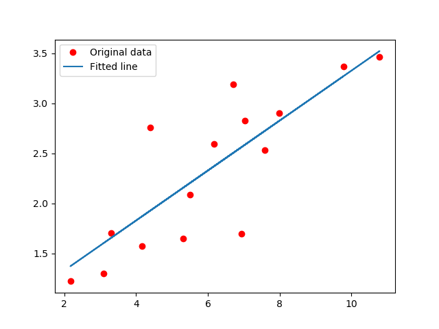

# :eyes: Outline
1. [main.py](main.py)


# 1. main.py
## 1.1- Terminal
```
D:\11-deepLearning_w16\03-regression\linear_regression> py .\main.py
```

## 1.2- Output
```
Epoch [5/60], Loss: 2.1528
Epoch [10/60], Loss: 0.9732
Epoch [15/60], Loss: 0.4953
Epoch [20/60], Loss: 0.3017
Epoch [25/60], Loss: 0.2232
Epoch [30/60], Loss: 0.1915
Epoch [35/60], Loss: 0.1786
Epoch [40/60], Loss: 0.1734
Epoch [45/60], Loss: 0.1713
Epoch [50/60], Loss: 0.1704
Epoch [55/60], Loss: 0.1701
Epoch [60/60], Loss: 0.1699
```

## 1.3- Solution
* Output:
  * 盡量找一條線，如下圖中的藍線，去符合所有的紅點分布。
<br>



<br>


## 1.4- Explain
* 此為 **線性回歸**。

<br>

--
## Reference
