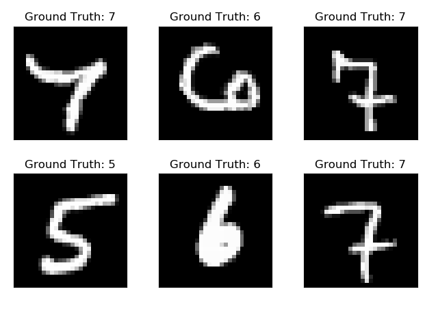
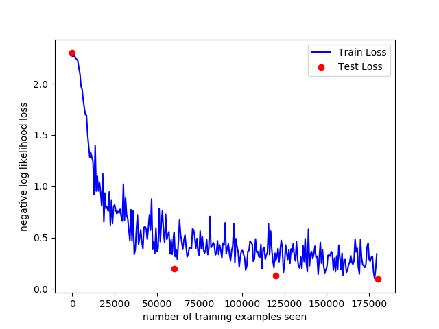

# :eyes: Outline
1. [mnist2.py](mnist2.py)


# 1. mnist2.py
## 1.1- Terminal
```
D:\11-deepLearning_w16\03-regression\linear_regression> py .\main.py
```

## 1.2- Output
```
Test set: Avg. loss: 2.3004, Accuracy: 751/10000 (7%)

Train Epoch: 1 [0/60000 (0%)]   Loss: 2.268457
Train Epoch: 1 [640/60000 (1%)] Loss: 2.268337
Train Epoch: 1 [1280/60000 (2%)]        Loss: 2.274000
...
Train Epoch: 1 [58880/60000 (98%)]      Loss: 0.335776
Train Epoch: 1 [59520/60000 (99%)]      Loss: 0.487062

Test set: Avg. loss: 0.1975, Accuracy: 9437/10000 (94%) # 1st

Train Epoch: 2 [0/60000 (0%)]   Loss: 0.549442
Train Epoch: 2 [640/60000 (1%)] Loss: 0.314246
Train Epoch: 2 [1280/60000 (2%)]        Loss: 0.381319
...
Train Epoch: 2 [58880/60000 (98%)]      Loss: 0.205928
Train Epoch: 2 [59520/60000 (99%)]      Loss: 0.345963

Test set: Avg. loss: 0.1264, Accuracy: 9614/10000 (96%) # 2nd

Train Epoch: 3 [0/60000 (0%)]   Loss: 0.272734
Train Epoch: 3 [640/60000 (1%)] Loss: 0.312503
Train Epoch: 3 [1280/60000 (2%)]        Loss: 0.392842
...
Train Epoch: 3 [58880/60000 (98%)]      Loss: 0.196487
Train Epoch: 3 [59520/60000 (99%)]      Loss: 0.340549

Test set: Avg. loss: 0.0921, Accuracy: 9716/10000 (97%) # 3rd
```

## 1.3- Solution
* Output:
  * 先把圖片的前 6張顯示出來，也知道各圖片的辨識答案。
  * 之後再拿到模型中進行訓練。
  * **剛開始的準確率低**： `Test set: Avg. loss: 2.3004, Accuracy: 751/10000 (7%)`
<br>



<br>
  
  * 第一輪： `Test set: Avg. loss: 0.1975, Accuracy: 9437/10000 (94%)`
  * 第二輪： `Test set: Avg. loss: 0.1264, Accuracy: 9614/10000 (96%)`
  * 第三輪： `Test set: Avg. loss: 0.0921, Accuracy: 9716/10000 (97%)`
  * 經過 3輪的訓練，**降低 loss，提升Accuracy**。
<br>



<br>

## 1.4- Explain
* 此為辨識手寫數字 MNIST 的模型

<br>

--
## Reference
* [MNIST Handwritten Digit Recognition in PyTorch](https://nextjournal.com/gkoehler/pytorch-mnist)