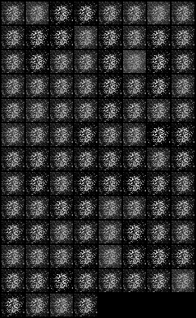
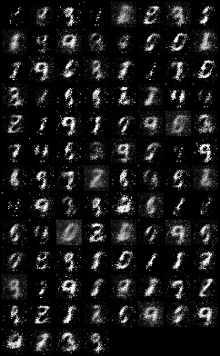
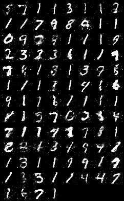
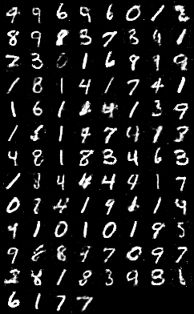

# :eyes: Outline
1. [main.py](main.py)


# 1. main.py
## 1.1- Terminal
```
D:\11-deepLearning_w16\07-gan\01-gan_mnist> py .\main.py
```

## 1.2- Output
```
Epoch [0/200], Step [200/600], d_loss: 0.0358, g_loss: 4.0882, D(x): 1.00, D(G(z)): 0.03
Epoch [0/200], Step [400/600], d_loss: 0.0886, g_loss: 6.1392, D(x): 0.97, D(G(z)): 0.03
Epoch [0/200], Step [600/600], d_loss: 0.1176, g_loss: 5.3221, D(x): 0.95, D(G(z)): 0.04
Epoch [1/200], Step [200/600], d_loss: 0.0812, g_loss: 5.2275, D(x): 0.99, D(G(z)): 0.06   # 1st
Epoch [1/200], Step [400/600], d_loss: 0.3796, g_loss: 4.2272, D(x): 0.94, D(G(z)): 0.25
Epoch [1/200], Step [600/600], d_loss: 0.0497, g_loss: 6.1998, D(x): 0.97, D(G(z)): 0.01
Epoch [2/200], Step [200/600], d_loss: 0.1207, g_loss: 4.7717, D(x): 0.94, D(G(z)): 0.03   # 2nd
Epoch [2/200], Step [400/600], d_loss: 0.6747, g_loss: 3.3693, D(x): 0.79, D(G(z)): 0.17
Epoch [2/200], Step [600/600], d_loss: 0.1033, g_loss: 4.6607, D(x): 0.96, D(G(z)): 0.05
Epoch [3/200], Step [200/600], d_loss: 0.0600, g_loss: 4.5846, D(x): 0.99, D(G(z)): 0.05   # 3rd
Epoch [3/200], Step [400/600], d_loss: 0.3299, g_loss: 3.7186, D(x): 0.92, D(G(z)): 0.16
Epoch [3/200], Step [600/600], d_loss: 0.5722, g_loss: 2.5391, D(x): 0.85, D(G(z)): 0.25
...
Epoch [20/200], Step [200/600], d_loss: 0.1977, g_loss: 3.4947, D(x): 0.96, D(G(z)): 0.10   # 20th
Epoch [20/200], Step [400/600], d_loss: 0.2860, g_loss: 5.1820, D(x): 0.91, D(G(z)): 0.07
Epoch [20/200], Step [600/600], d_loss: 0.1442, g_loss: 6.8898, D(x): 0.94, D(G(z)): 0.03
...
Epoch [50/200], Step [200/600], d_loss: 0.7037, g_loss: 2.2526, D(x): 0.96, D(G(z)): 0.35   # 50th
Epoch [50/200], Step [400/600], d_loss: 0.7296, g_loss: 2.6820, D(x): 0.77, D(G(z)): 0.17
Epoch [50/200], Step [600/600], d_loss: 0.5775, g_loss: 2.6484, D(x): 0.78, D(G(z)): 0.13
...
Epoch [100/200], Step [200/600], d_loss: 0.9810, g_loss: 1.9163, D(x): 0.68, D(G(z)): 0.29  # 100th
Epoch [100/200], Step [400/600], d_loss: 0.6782, g_loss: 2.3010, D(x): 0.75, D(G(z)): 0.20
Epoch [100/200], Step [600/600], d_loss: 0.8045, g_loss: 1.5415, D(x): 0.71, D(G(z)): 0.23
...
Epoch [150/200], Step [200/600], d_loss: 0.9088, g_loss: 1.7319, D(x): 0.69, D(G(z)): 0.29  # 150th
Epoch [150/200], Step [400/600], d_loss: 0.9613, g_loss: 1.7658, D(x): 0.67, D(G(z)): 0.30
Epoch [150/200], Step [600/600], d_loss: 1.1170, g_loss: 1.6940, D(x): 0.63, D(G(z)): 0.33
...
Epoch [198/200], Step [600/600], d_loss: 0.7973, g_loss: 1.1437, D(x): 0.72, D(G(z)): 0.29  # 200th
Epoch [199/200], Step [200/600], d_loss: 0.8580, g_loss: 1.9831, D(x): 0.72, D(G(z)): 0.28
Epoch [199/200], Step [400/600], d_loss: 0.8484, g_loss: 1.5868, D(x): 0.67, D(G(z)): 0.25
Epoch [199/200], Step [600/600], d_loss: 1.0439, g_loss: 1.2249, D(x): 0.62, D(G(z)): 0.31
```

## 1.3- Solution
* 生成對抗網路模型，有兩個，一個是 Generator，另一個是 Discriminator。
* 訓練 200代
* Output:
  

* **經過每一輪訓練，Generator生成的手寫數字圖片會越來越好**。
<br>

* 第 1 代的結果，還看不出個樣子。
<br>



<br>

* 第 20 代的結果，有點樣子了。
<br>



<br>


* 第 100 代的結果，學習得越來越像。
<br>



<br>


* 第 200 代的結果，最後的學習成果。
<br>



<br>


## 1.4- Explain
* 生成對抗網路模型(GAN) 生成 **假的** 手寫數字識別(MNIST)
* **Fake Images**

<br>

--

## Reference
