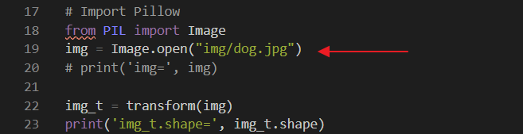
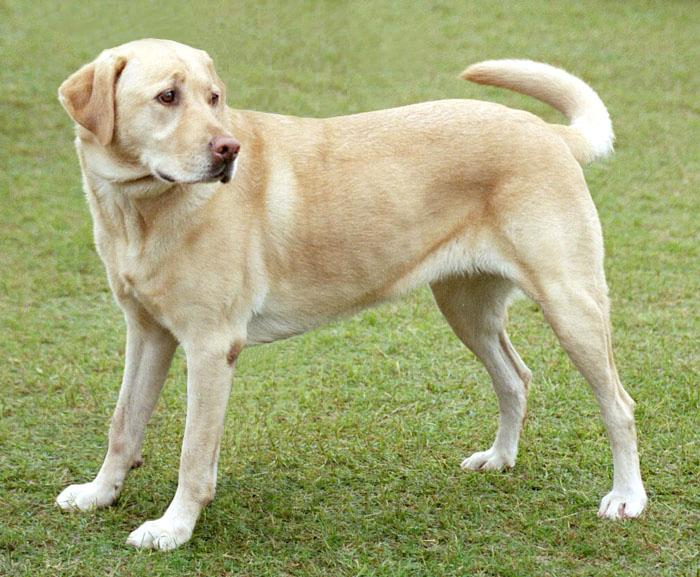
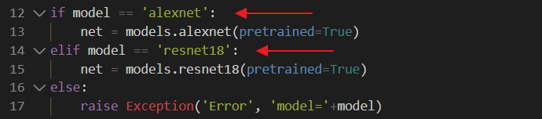
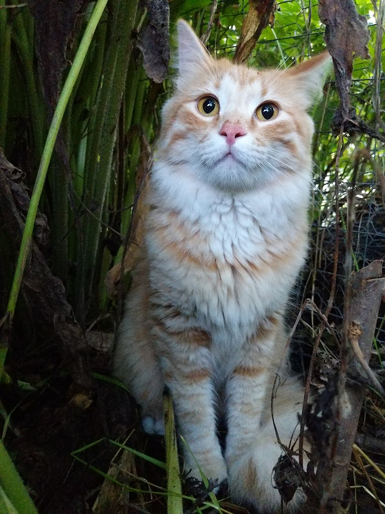

# :eyes: Outline
1. [alexnet.py](alexnet.py)
2. [predict.py](predict.py)

# 1. alexnet.py
## 1.1- Terminal
```
D:\11-deepLearning_w16\01-pretrained\01-torchvision\01-classify> py .\alexnet.py
```

## 1.2- Output
```
img_t.shape= torch.Size([3, 224, 224])
batch_t.shape= torch.Size([1, 3, 224, 224])
preds.shape= torch.Size([1, 1000])
Labrador retriever    # Output
```

## 1.3- Solution
* 這裡將想辨識的照片寫入，欲辨識的物體是 **狗** 照片。
<br>


<br>

* Output:
  * ``Labrador retriever``
  * 辨識結果，顯示狗的品種為 **拉不拉多 獵犬**。

<br>


## 1.4- Explain
* 這裡是將要辨認的照片寫死在程式碼中，指定辨識狗的照片。
  

# 2. predict.py
## 2.1- Terminal
```
D:\11-deepLearning_w16\01-pretrained\01-torchvision\01-classify> py .\predict.py resnet18 img/cat.jpg
```

## 2.2- Output
```
img_t.shape= torch.Size([3, 224, 224])
batch_t.shape= torch.Size([1, 3, 224, 224])
preds.shape= torch.Size([1, 1000])
lynx, catamount     # Output     
```

## 2.3- Solution
* 這裡將欲辨識的物體是 **貓** 照片。
* 選擇的網路模型是 **Resnet18**
<br>



<br>

* Output:
  * ``lynx, catamount``
  * 辨識結果，顯示貓的品種為 **山貓(學名：猞猁屬) 貓科**。

<br>

## 2.4- Explain
* 這裡可以自有選擇想要的模型，以及想辨識的照片。
* 模型有兩種選擇：
  * AlexNet
  * Resnet18

--

## Reference
