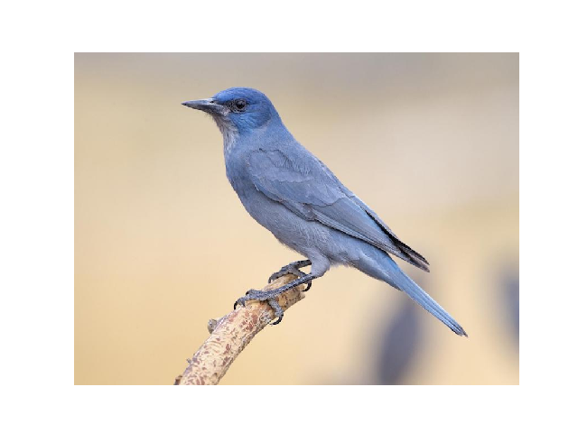
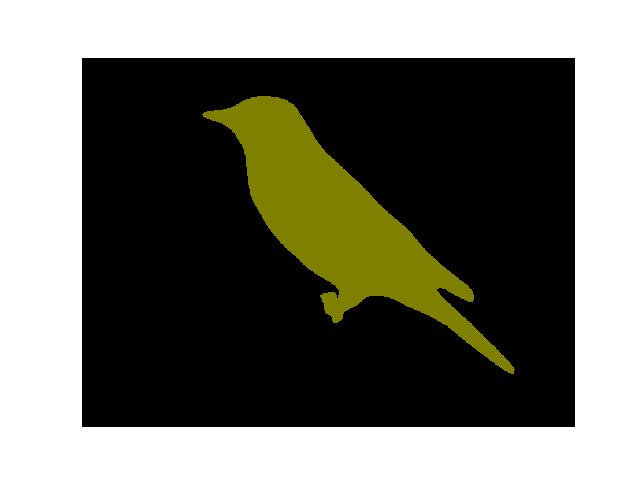
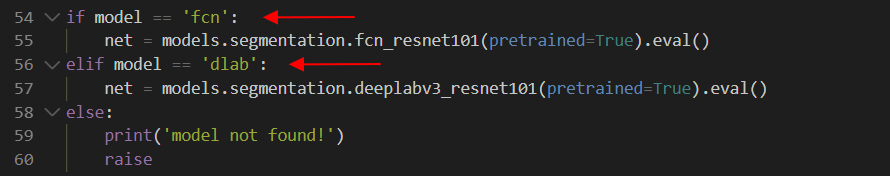
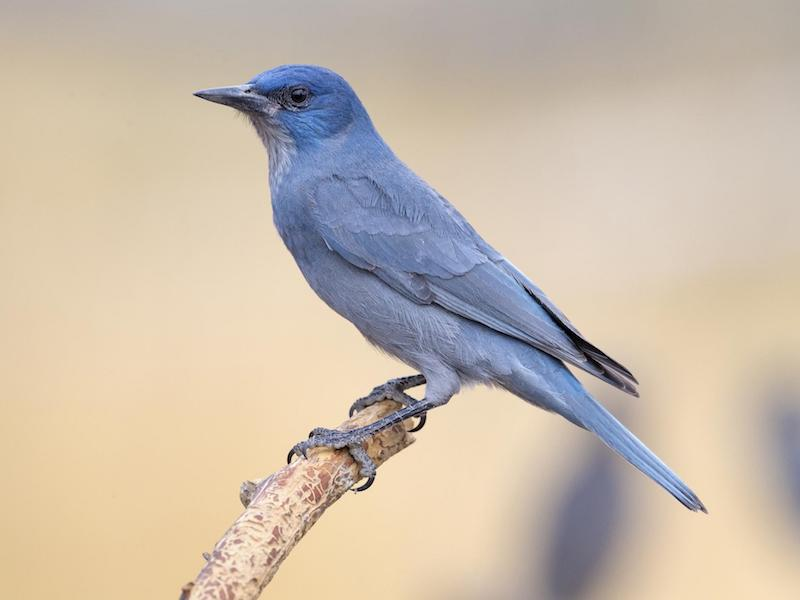
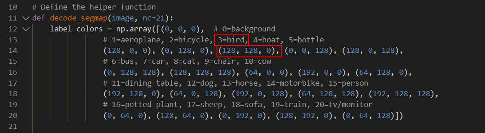
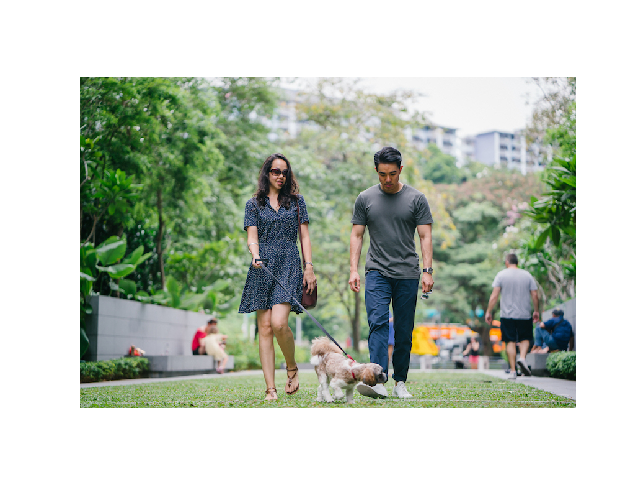

# :eyes: Outline
1. [segment.py](segment.py)

# 1. segment.py
## 1.1- Terminal
```
D:\11-deepLearning_w16\01-pretrained\01-torchvision\02-semantic> py .\segment.py dlab .\img\bird.jpg
```

## 1.2- Output

<br>


<br>

## 1.3- Solution
* 這裡將欲辨識的物體是 **鳥** 照片。
* 選擇的網路模型是 **dlab**
<br>




<br>

* Output:
  * 一開始會先開啟原圖，再顯示 **顏色遮罩的地方** 是一隻鳥。
  * 辨識結果，顯示 **一隻鳥**。
<br>


## 1.4- Explain
* TorchVision -- Semantic Segmentation
* 語義分割
* 當一張圖片訓練時，模型會將圖片中 **各個部分** 進行 **標記**，例如標記紅色是「人」、綠色是「動物」等。
* 模型有兩種選擇：
  * fcn
  * dlab
<br>

* **定義** 識別的物體、顏色
  * 背景 = 白色 rgb(0, 0, 0)
  * 鳥 = 軍綠色 rgb(128, 128, 0)
  * 船 = 藍色 rgb(0, 0, 128)
  * 人 = 粉紅色 rgb(192, 128, 128)
  * 狗 = 紫色 rgb(64, 0, 128)
<br>



<br>

## 再辨識一個
* Input
```
D:\11-deepLearning_w16\01-pretrained\01-torchvision\02-semantic> py .\segment.py dlab .\img\person.jpg
```
* Output
<br>



<br>

--

## Reference
[1] [pytorch出现RuntimeError: CUDA out of memory._CSDN](https://blog.csdn.net/pursuit_zhangyu/article/details/88717635)
[2] [色碼表_Online](https://www.ifreesite.com/color/)