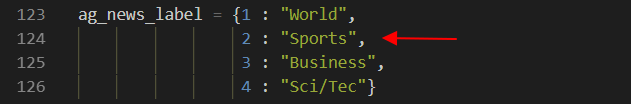

# :eyes: Outline
1. [torchtext_classify.py](torchtext_classify.py)


# 1. torchtext_classify.py
## 1.1- Terminal
```
D:\11-deepLearning_w16\01-pretrained\\02-torchtext\01-classify1> py .\torchtext_classify.py
```

## 1.2- Output
```
This is a Sports news
```

## 1.3- Solution
* 這裡將一則 **關於運動的新聞文章輸入**，進行辨識。
<br>

* 欲辨識的文章內容
```
MEMPHIS, Tenn. – Four days ago, Jon Rahm was \
enduring the season’s worst weather conditions on Sunday at The \
Open on his way to a closing 75 at Royal Portrush, which \
considering the wind and the rain was a respectable showing. \
Thursday’s first round at the WGC-FedEx St. Jude Invitational \
was another story. With temperatures in the mid-80s and hardly any \
wind, the Spaniard was 13 strokes better in a flawless round. \
Thanks to his best putting performance on the PGA Tour, Rahm \
finished with an 8-under 62 for a three-stroke lead, which \
was even more impressive considering he’d never played the \
front nine at TPC Southwind.
```

<br>

* Output:
  * ``This is a Sports news``
  * 辨識結果，顯示這是一則 **運動新聞**。

<br>


## 1.4- Explain
* 此模型用於辨識 **文章內容**，屬於哪種分類。
* 文章分類標籤，主要分　4類：
  * 世界、運動、商業、科技
<br>



<br>

--
## Reference
[1] [No module named 'torchtext'_Stack Overflow](https://stackoverflow.com/questions/42711144/how-can-i-install-torchtext)