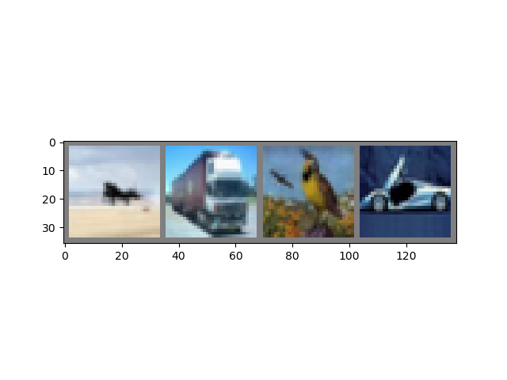

# :eyes: Outline
1. [cifar.py](cifar.py)


# 1. cifar.py
## 1.1- Terminal
```
D:\11-deepLearning_w16\05-cnn\01-cifar> py .\cifar.py predict
```

## 1.2- Output
```
Answer: plane truck  bird   car
Predicted: plane truck  bird   car
```

## 1.3- Solution
* Output:
  * 先顯示圖片答案，再進行圖片辨識，預測結果。
  * 答案為 飛機、卡車、鳥、車
  * 預測為 飛機、卡車、鳥、車
<br>



<br>


## 1.4- Explain
* 此為 **十分類照片(Cifar-10)** 之模型

<br>

--
## Reference
* [TRAINING A CLASSIFIER in PyTorch](https://pytorch.org/tutorials/beginner/blitz/cifar10_tutorial.html)