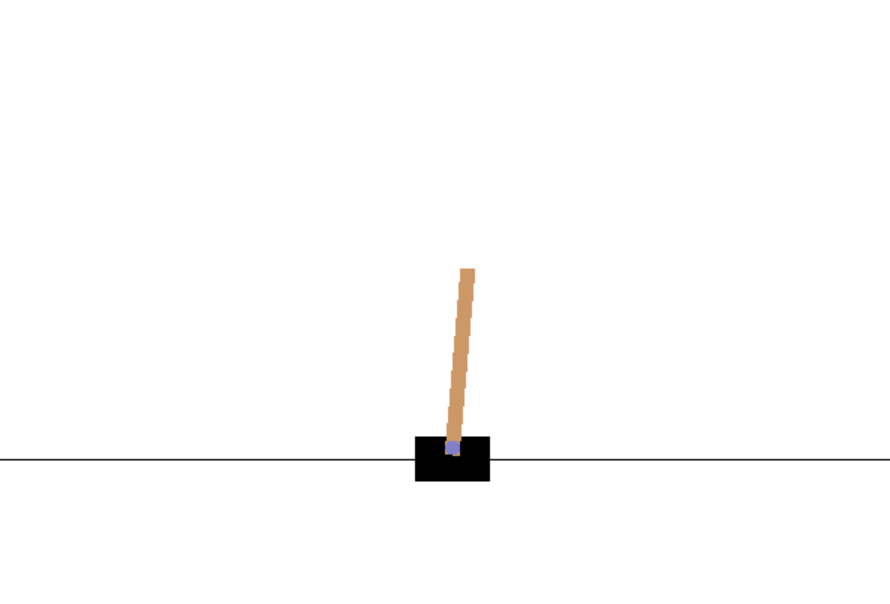
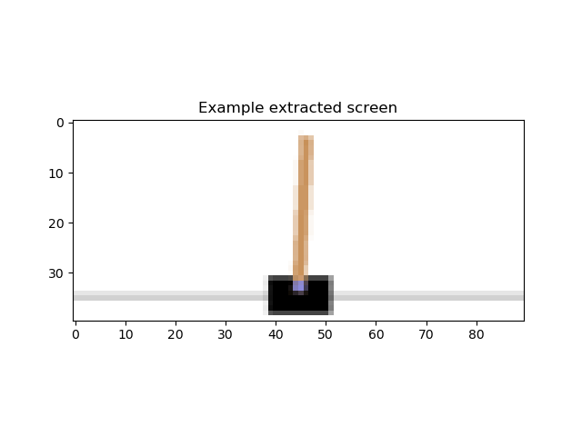
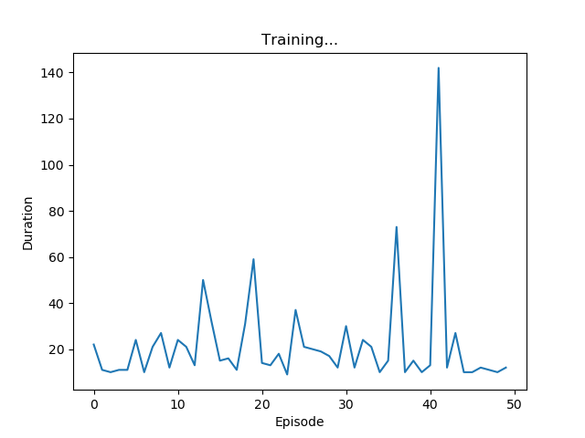

# :eyes: Outline
1. [cartpole.py](cartpole.py)


# 1. cartpole.py
## 1.1- Terminal
```
D:\11-deepLearning_w16\08-reinforce\01-cartpole> py .\cartpole.py
```

## 1.2- Output
```
Complete
```

## 1.3- Solution
* 一個遊戲，要平衡倒單擺，不能使它傾倒。
* 每次傾倒，平衡失敗時，就學習其失敗的經驗。
* 訓練 50代，在這裡其實訓練的批量不夠，所以看不太出顯著的變化，可以在訓練多次一點。
* 可以放個 500-5000代，進行訓練。
* Output:
* **經過每一輪訓練，維持平衡的時間就會越來越持久**。
<br>

* 下圖，為倒單擺的平衡狀況。
<br>



<br>

* 下圖，為倒單擺的平衡分析。
<br>



<br>

* 訓練 50 代的結果
<br>



<br>


## 1.4- Explain
* 生成對抗網路模型(GAN) 學習 **平衡** 倒單擺 

<br>

--

## Reference
[1] [REINFORCEMENT LEARNING (DQN) TUTORIAL](https://pytorch.org/tutorials/intermediate/reinforcement_q_learning.html), Author: Adam Paszke
[2] [强化学习 (DQN) 教程](https://pytorch.apachecn.org/docs/1.0/reinforcement_q_learning.html)